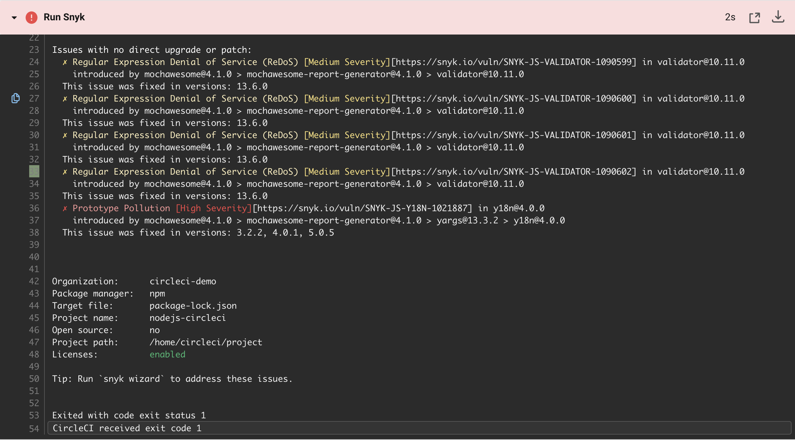
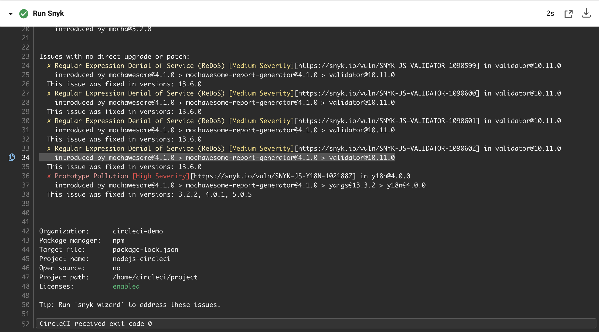
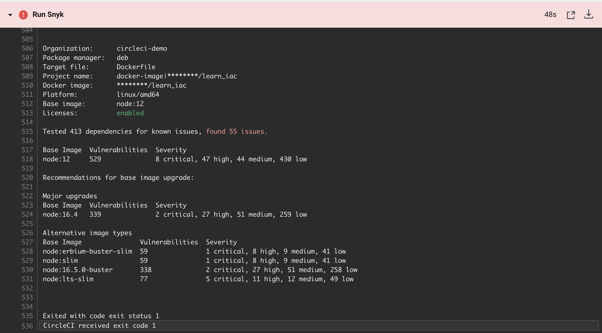
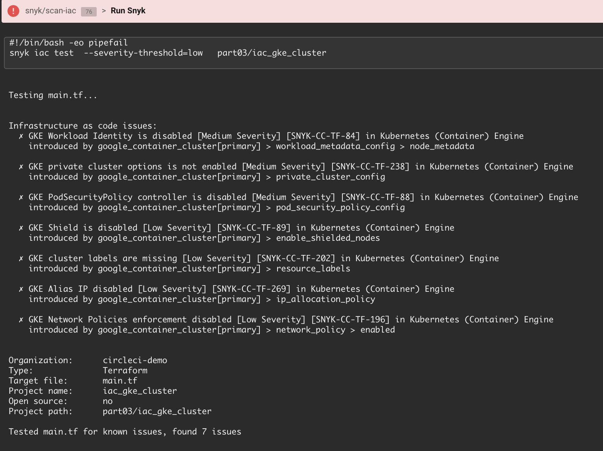
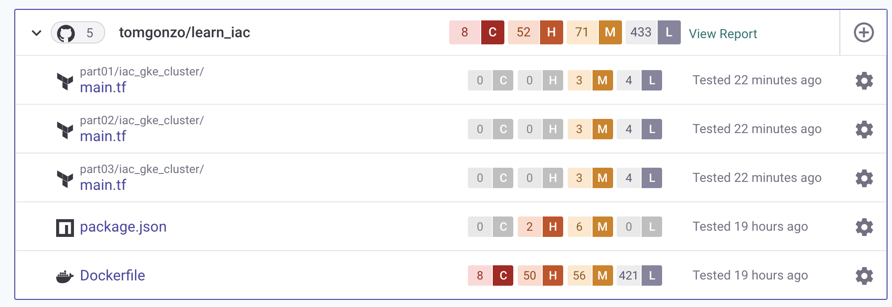

# Security with Snyk in CircleCI Workflows
Today’s applications are built using modern DevOps processes, with frequent integration and deployments several times a day. To enable pace and scale, application security must start with developers, with security teams moving from an audit and gate function to an empowering and governing role.

## Securing Cloud-Native Applications
Applications have changed as cloud native technologies like containers, Kubernetes and Terraform have replaced infrastructure with code. These elements are now built and customized by developers, and live in their repositories.

Securing cloud native applications requires shifting the ownership of these application components, traditionally part of IT security, into the application security model. As developers take ownership for the first steps in security, security testing tools that integrate into their workflows and present information in a developer-friendly way become essential to their productivity.

## Getting started with Snyk
The Snyk Orb makes it easy for DevSecOps teams to integrate testing into CircleCI workflows. With the Snyk Orb you can install, run tests, and monitor projects with Snyk. You can also set a threshold for failing builds, depending on your risk tolerance. Scan results present clear information to help developers quickly make sense of the issues and fixes, if available.

In this tutorial we use the Snyk Orb to demonstrate how to prevent vulnerabilities from passing through the build process by adding automated Snyk tests into a CircleCI workflow.

### Prerequisites
To follow this guide, you'll need:
1. A [CircleCI](https://circleci.com/signup/) Account
2. A [GitHub](https://github.com/signup) Account
3. A [Snyk](https://app.snyk.io/login?utm_campaign=Tutorial-Blog-Jul21&utm_medium=Partner&utm_source=CircleCI) Account

You need a Snyk API Token to use the Snyk Orb. [Create a Snyk Token](https://support.snyk.io/hc/en-us/articles/360004008278-Revoking-and-regenerating-Snyk-API-tokens), then [set an Environment Variable in CircleCI](https://circleci.com/docs/2.0/env-vars/#setting-an-environment-variable-in-a-project) called SNYK_TOKEN with its value. 

This tutorial makes the most sense after completing the Infrastructure as Code module in [CircleCI Academy](https://academy.circleci.com). You can complete this tutorial without completing the module, but the Terraform workflows will fail.

### Fork the demo project
In this tutorial we use the repository from the CircleCI Academy module. There, you create a workflow that uses Terraform to create a GKE cluster and deploy an application into it as part of a continuous delivery pipeline. 

If you didn't complete the module, navigate to the [learn_iac repo](https://github.com/datapunkz/learn_iac) and fork it. Once forked, head to the [CircleCI Projects](https://app.circleci.com/) page, click `Set up Project`, then select `Use Existing Config`.

### Ensure dependencies are secure and compliant with Snyk Open Source
If you completed the Academy module, you deployed an application with open source components, but didn't check them for vulnerabilities! Integrating Snyk Open Source into the CI workflow makes security and compliance testing part of the pipeline, allowing us to prevent applications with vulnerable dependencies from making their way into production.

To add Snyk Open Source, open the .circleci/config.yml file in an editor then add the Snyk Orb to the top, replacing @x.y.z with the latest version of the [Snyk Orb in the Orb Registry](https://circleci.com/developer/orbs/orb/snyk/snyk). 

````YAML
version: 2.1

orbs:
  snyk: snyk/snyk@1.0.1
  
jobs:
  run_tests:
    docker:
      - image: circleci/node:12
````

Adding the Orb exposes the snyk commands and jobs to your workflow. Consider your requirements when choosing where in the workflow to add them. For this example, add the `snyk/scan` command to the `run_tests` job to check for vulnerabilities and license issues before running unit tests.

````YAML
jobs:
  run_tests:
    docker:
      - image: circleci/node:12
    steps:
      - checkout
      - run:
          name: Install npm dependencies
          command: |
            npm install --save
      - snyk/scan
      - run:
          name: Run Unit Tests
````

Save and commit your changes. When the workflow runs, the `run_tests` job fails because the `package.json` file declares vulnerable dependencies. 



Good thing you checked! However, you might not want to introduce too much disruption into your pipelines too early. 

It's possible to customize this behavior by passing parameters to the Orb. To allow the workflow to continue uninterrupted, add the `fail-on-issues` parameter to the `snyk/scan` command and commit your changes. For a list of available parameters, view the [Snyk Orb in the Orb Registry](https://circleci.com/developer/orbs/orb/snyk/snyk).

````YAML
- run:
          name: Install npm dependencies
          command: |
            npm install --save
      - snyk/scan:
          fail-on-issues: false
      - run:
          name: Run Unit Tests
          command: |
````

Next time the pipeline runs, it will still find issues, but it will continue to the next job. 



To learn how to interpret the CLI results to [remediate open source vulnerabilities](https://support.snyk.io/hc/en-us/articles/360006113798-Remediate-your-vulnerabilities), visit the Snyk documentation.

### Scan and secure container images with Snyk Container
Besides your application dependencies, your choice of container base image can also introduce vulnerable open source components by means of operating system packages and language runtimes. 

Snyk Container uses the same `snyk/scan` command with a few parameters. Since the image needs to be built to scan it, add the command to the `build_docker_image` job between the `docker build` and `docker push` steps by breaking up the existing command. Notice the use of the `severity-threshold` parameter to only report issues of high or critical severity.

If you didn't complete the CircleCI Academy module, you'll need to [set an environment variable](https://circleci.com/docs/2.0/env-vars/#setting-an-environment-variable-in-a-project) called `DOCKER_LOGIN` with your Docker ID or whatever you want to name the image for this to work.

````YAML
build_docker_image:
    docker:
      - image: circleci/node:12
    steps:
      - checkout
      - setup_remote_docker:
          docker_layer_caching: false
      - run:
          name: Build Docker image
          command: |
            export TAG=0.2.<< pipeline.number >>
            export IMAGE_NAME=$CIRCLE_PROJECT_REPONAME
            docker build -t $DOCKER_LOGIN/$IMAGE_NAME -t $DOCKER_LOGIN/$IMAGE_NAME:$TAG .
      - snyk/scan:
          severity-threshold: high
          docker-image-name: $DOCKER_LOGIN/$CIRCLE_PROJECT_REPONAME
          target-file: "Dockerfile"
          fail-on-issues: true
      - run:
          name: Push Docker image
          command: |
            echo $DOCKER_PWD | docker login -u $DOCKER_LOGIN --password-stdin
            docker push $DOCKER_LOGIN/$IMAGE_NAME
````
When the scan completes, Snyk will fail the stage because of high severity vulnerabilities. Like with Snyk Open Source, it's possible to customize this behavior by passing additional parameters to the Orb.



Using Snyk to break the build after a container scan, like in this example, is one way to prevent an image with vulnerabilities from being pushed to the container registry. 

Visit the Snyk Documentation to learn how to [Understand Snyk Container CLI results](https://support.snyk.io/hc/en-us/articles/360003946937-Understanding-Snyk-Container-CLI-results), and be sure to explore out the section on Base Image Remediation Guidance!

### Use Snyk Infrastructure as Code to fix Terraform misconfigurations
As we discussed above, modern applications are more than code and open source components; in the cloud era, infrastructure is part of the application. While Cloud Providers provide tools to manage cloud configuration, misconfiguration of cloud resources remains the most prevalent cloud vulnerability and can be exploited to access cloud data and services. That's where Snyk IaC comes in, to provide curated security information that gives developers what they need to find and fix configuration issues and move on. 

As of Orb version `1.0.0`, Snyk Infrastructure as Code is available as a `job` that can be added directly into the `workflow`. For this example, add the snyk/scan-iac job before the gke-create-cluster job to check Terraform files are correctly configured before creating the cloud infrastructure. The args parameter points to which files to check for misconfigurations and can also be used to pass other [Snyk CLI arguments](https://support.snyk.io/hc/en-us/articles/360018728618-Test-your-configuration-files).

````
workflows:
  build_test:
    jobs:
      - run_tests
      - build_docker_image
      - snyk/scan-iac:
          args: part03/iac_gke_cluster/
      - gke_create_cluster:
          requires:
            - run_tests
            - build_docker_image
            - snyk/scan-iac
````

Like with all other Snyk scans, the default behavior is to break the build in case of any misconfigurations. 



Visit the Snyk Academy to learn ways to [customize the IaC scan parameters](https://solutions.snyk.io/partner-workshops/circleci/scan-terraform-with-the-snyk-orb/adjusting-snyk-iac-scan-parameters) in this workflow.

### Augmenting the Developer Experience
If you made it this far, congratulations! Your delivery pipeline now has security testing for issues introduced by your application's open source dependencies, container base image, and the Terraform files that deploy it into a production GKE environment. We can make this information more accessible and actionable for developers by also integrating Snyk where they work, the IDE and their Source Control repository. 

To integrate Snyk into SCM, import your fork of the `learn-iac` repo to Snyk using the SCM integration. Visit the [Snyk documentation for the GitHub integration](https://support.snyk.io/hc/en-us/articles/360004032117-GitHub-integration) to learn how. Once imported, you'll see the files we tested in this tutorial, and their risks, in the Snyk UI. This enhances developer productivity with features like Fix Pull Requests - visit the [SCM integration best practices](https://support.snyk.io/hc/en-us/articles/360018010597-Snyk-SCM-integration-good-practices) page to learn more.



To use Snyk in your IDE, download any of the [IDE Plugins available](https://snyk.io/ide-plugins/), or use the [Snyk CLI](https://support.snyk.io/hc/en-us/articles/360003812578-CLI-reference). 

## Conclusion
Awareness of the security risks introduced by your developers' choice of open source, container, and infrastructure configuration is an essential first step toward building a culture of collaboration between security teams responsible for preventing production issues, operations teams responsible for pipelines running, and developers in charge of fixing issues. 

Want to learn more? Visit the Snyk Documentation to read our [best practices for integrating Snyk into CI/CD pipelines](https://support.snyk.io/hc/en-us/articles/360018245398-Snyk-CI-CD-Integration-good-practices-). 
